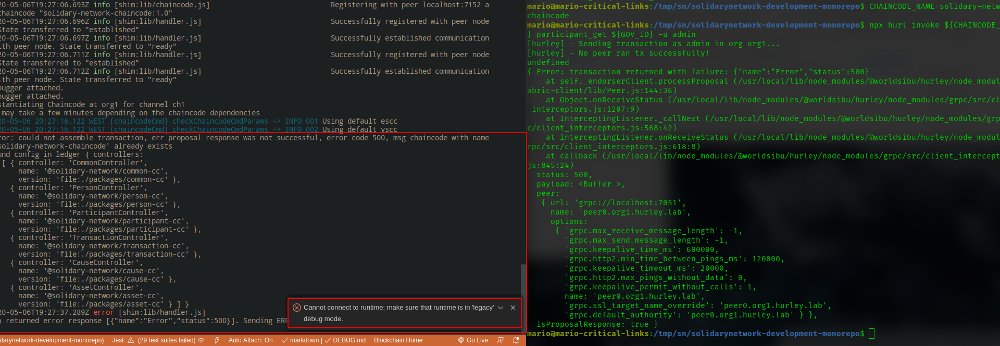

# DEBUG NOTES

- [DEBUG NOTES](#debug-notes)
  - [Versions Used](#versions-used)
  - [Important Notes](#important-notes)
  - [MODE1: Start in debug chaincode](#mode1-start-in-debug-chaincode)
    - [1. restart network manually with npm run env:restart](#1-restart-network-manually-with-npm-run-envrestart)
    - [2. launch chaincode in debug mode](#2-launch-chaincode-in-debug-mode)
    - [3. now wait that the chaincode in running](#3-now-wait-that-the-chaincode-in-running)
    - [4. Create Views](#4-create-views)
    - [5. Add some seed to ledger](#5-add-some-seed-to-ledger)
    - [6. Debug breakpoints](#6-debug-breakpoints)
    - [7. Edit and deploy chaincode again](#7-edit-and-deploy-chaincode-again)
  - [MODE2 WIP: Debug with normal restartEnv.sh after some updates debug with `cc:start:debug` and chaincode version](#mode2-wip-debug-with-normal-restartenvsh-after-some-updates-debug-with-ccstartdebug-and-chaincode-version)
  - [MODE3: View logs/ open terminal in normal update-chaincode.sh mode](#mode3-view-logs-open-terminal-in-normal-update-chaincodesh-mode)
  - [Problems and Solutions](#problems-and-solutions)
    - [Error #ERR-DEBUG-001](#error-err-debug-001)
    - [Error #ERR-DEBUG-002](#error-err-debug-002)

## Versions Used

```shell
# node
$ node -v
v8.16.0
# hurley global
$ hurl --version
1.1.4
# local
$ npx hurl --version
1.1.4
```

## Important Notes

1. to change chaincode while debug, use `dist/**/*.js` file versions
2. if change are made in `chaincode-solidary-chain-chaincode/**/*.ts` source code while debugging, don't forget to apply the same changes on `packages/**/*.ts`
3. if have problems with debug, remove chaincode dir, I lost a **few hours** to figure out that the problem is in a sort of error, check error

## MODE1: Start in debug chaincode

to start debug and develop chaincode always follow this steps to prevent some hard times put debugger working......

### 1. restart network manually with npm run env:restart

...without `restartEnv.sh` script, and without deploying chaincode, on network, we use debug mode environment, that does not lift any container, else it won't work

```shell
# restart hyperledger network
$ npm run env:restart
[hurley] - You can find the network topology (ports, names) here: /home/mario/hyperledger-fabric-network/docker-compose.yaml
```

### 2. launch chaincode in debug mode

```shell
# start define CHAINCODE_NAME
$ CHAINCODE_NAME=solidary-chain-chaincode
# to prevent problems rm chaincode-solidary-chain-chaincode in version 1.0
$ rm -r chaincode-${CHAINCODE_NAME}
# launch chaincode debug, NOTE this command must be run inside Vscode to attach debugger (side note it will build all packages)
$ npm run cc:start:debug -- ${CHAINCODE_NAME}
```

```shell
# `dev-peer0.org2.hurley.lab-solidary-chain-chaincode-1.x` container, won't appear with below command, like it does when we deploy chaincode without `cc:start:debug`, ex with `restartEnv.sh`
$ watch "docker container ls --format "{{.Names}}" | grep \"${CHAINCODE_NAME}\""
```

### 3. now wait that the chaincode in running

UPDATE: 2020-10-27 22:03:45 we need to press F5 and use `"Attach to Chaincode"` `launch.json` config when we land in `Instantiated Chaincode at org1`, and `Debugger attached`

```shell
# debugger attached
Debugger attached.
...
# require to wait for Instantiating Chaincode message before launch debugger
It may take a few minutes depending on the chaincode dependencies
2020-10-27 22:40:16.525 WET [chaincodeCmd] checkChaincodeCmdParams -> INFO 001 Using default escc
2020-10-27 22:40:16.525 WET [chaincodeCmd] checkChaincodeCmdParams -> INFO 002 Using default vscc
info: [Chaincode] =========== Instantiated Chaincode chaincode ===========
info: [Chaincode] Transaction ID: b044b5330671dcd90527bfb3f33259fde0cac473fa1e690a7407b657d1a1e4c3
info: [Chaincode] Args: init,
2020-10-27T22:40:16.538Z info [shim:lib/handler.js]                               [ch1-b044b533] Calling chaincode Init() succeeded. Sending COMPLETED message back to peer  
Instantiated Chaincode at org1
```

> ignore error `Error: could not assemble transaction, err proposal response was not successful, error code 500, msg chaincode with name 'solidary-chain-chaincode' already exists`, sometimes it gives that error because we forget to define variable with `CHAINCODE_NAME=solidary-chain-chaincode`

when work appears

```shell
incode Init() succeeded. Sending COMPLETED message back to peer
Instantiated Chaincode at org1
```

### 4. Create Views

```shell
$ ./couchdb/install.sh
```

### 5. Add some seed to ledger

> TIP: here we can launch F5 and attach debugger and stop in breakpoints when we seed

> advice to launch line by line in case of problems....to debug bad invokes

```shell
$ ./seed.sh
```

### 6. Debug breakpoints

add some breakpoints on `chaincode-solidary-chain-chaincode/packages/@solidary-chain/transaction-cc/src` or `chaincode-solidary-chain-chaincode/packages/@solidary-chain/transaction-cc/dist/src` and have fun

### 7. Edit and deploy chaincode again

after edit code changes, stop current debug with ctrl+c and re-launch chaincode in debug mode again and that's all, it is VERY FAST and we assure we edit the source *.ts

```shell
# start define CHAINCODE_NAME
$ CHAINCODE_NAME=solidary-chain-chaincode
$ npm run cc:start:debug -- ${CHAINCODE_NAME}
# require to restart graphql server
$ npx lerna run start:debug
```

or edit files in `chaincode-solidary-chain-chaincode/packages/@solidary-chain/${PACKAGE}-cc/src/*.ts`

## MODE2 WIP: Debug with normal restartEnv.sh after some updates debug with `cc:start:debug` and chaincode version

```shell
$ npm run cc:start:debug -- ${CHAINCODE_NAME}
# if error occur use target debug version, recommend to always use current version, or if we are in version 1.3, use pass 1.4 to deploy and debug a new chaincode, and watch
$ npm run cc:start:debug -- ${CHAINCODE_NAME} 1.1
```

## MODE3: View logs/ open terminal in normal update-chaincode.sh mode

```shell
$ CHAINCODE_NAME=solidary-chain-chaincode
# view chaincode containers
$ VERSION=1.0
$ watch "docker container ls --format "{{.Names}}" | grep \"${CHAINCODE_NAME}-${VERSION}\""
# with chaincode version
$ VERSION=1.0
$ SEARCH_CONTAINER="dev-peer0.org1.hurley.lab-${CHAINCODE_NAME}-${VERSION}"
$ docker logs $(docker container ls | grep ${SEARCH_CONTAINER} | awk '{print $1}' | head -n 1) -f
# one liner  612  VERSION=2.1
$ VERSION=1.0 && SEARCH_CONTAINER="dev-peer0.org1.hurley.lab-${CHAINCODE_NAME}-${VERSION}" && docker logs $(docker container ls | grep ${SEARCH_CONTAINER} | awk '{print $1}' | head -n 1) -f
```

## Problems and Solutions

### Error #ERR-DEBUG-001



> first check above image

FIXED Debug Problem : Many Hours to try to figure out the problem, the debug was

1. checkout from git repo, and it works!
2. next remove the `chaincode-solidary-chain-chaincode` and try, and it works, the proof is somehow a sort of problem in `chaincode-solidary-chain-chaincode`, to prevent this is better to clean and rebuild `chaincode-solidary-chain-chaincode` on `cc:start:debug` script

the future fix to prevent this annoying error add `rm ./chaincode-$1 -r` to script `cc:start:debug` to always clean up folder

```json
{
  "scripts": {
    "cc:start:debug": "f() { rm ./chaincode-$1 -r; npm run cc:package -- $1 org1; npm run cc:install:debug $1; }; f",
  }
}
```

the ERROR:

```shell
$ npx hurl invoke ${CHAINCODE_NAME} participant_get ${GOV_ID} -u admin
[hurley] - Sending transaction as admin in org org1...
[hurley] - No peer ran tx successfully!
undefined
{ Error: transaction returned with failure: {"name":"Error","status":500}
    at self._endorserClient.processProposal (/usr/local/lib/node_modules/@worldsibu/hurley/node_modules/fabric-client/lib/Peer.js:144:36)
    at Object.onReceiveStatus (/usr/local/lib/node_modules/@worldsibu/hurley/node_modules/grpc/src/client_interceptors.js:1207:9)
    at InterceptingListener._callNext (/usr/local/lib/node_modules/@worldsibu/hurley/node_modules/grpc/src/client_interceptors.js:568:42)
    at InterceptingListener.onReceiveStatus (/usr/local/lib/node_modules/@worldsibu/hurley/node_modules/grpc/src/client_interceptors.js:618:8)
    at callback (/usr/local/lib/node_modules/@worldsibu/hurley/node_modules/grpc/src/client_interceptors.js:845:24)
  status: 500,
  payload: <Buffer >,
  peer: 
   { url: 'grpc://localhost:7051',
     name: 'peer0.org1.hurley.lab',
     options: 
      { 'grpc.max_receive_message_length': -1,
        'grpc.max_send_message_length': -1,
        'grpc.keepalive_time_ms': 600000,
        'grpc.http2.min_time_between_pings_ms': 120000,
        'grpc.keepalive_timeout_ms': 20000,
        'grpc.http2.max_pings_without_data': 0,
        'grpc.keepalive_permit_without_calls': 1,
        name: 'peer0.org1.hurley.lab',
        'grpc.ssl_target_name_override': 'peer0.org1.hurley.lab',
        'grpc.default_authority': 'peer0.org1.hurley.lab' } },
  isProposalResponse: true }
```

> TIP: now we only press one F5 on debugger to continue VS selecting the Auto attached process and F5 more than one time, GREAT NEWS


to prevent vscode and node problems, ex debug `solidary-chain-chaincode`

- [How to set and understand fs.notify.max_user_watches](https://unix.stackexchange.com/questions/444998/how-to-set-and-understand-fs-notify-max-user-watches)

### Error #ERR-DEBUG-002

```shell
$ npm run cc:start:debug -- ${CHAINCODE_NAME}
[nodemon] Internal watch failed: watch /media/mario/storage/Documents/Development/@SolidaryChain/solidarychain-development-monorepo/chaincode-solidary-chain-chaincode EMFILE
```

> bellow occurs in new os opensuse

```shell
# opening /etc/sysctl.conf in an editor and adding this to it:
$ sudo nano /etc/sysctl.conf

# add

fs.inotify.max_user_watches=524288
```

Then run sudo `sysctl -p` to process the changes made to the file.
