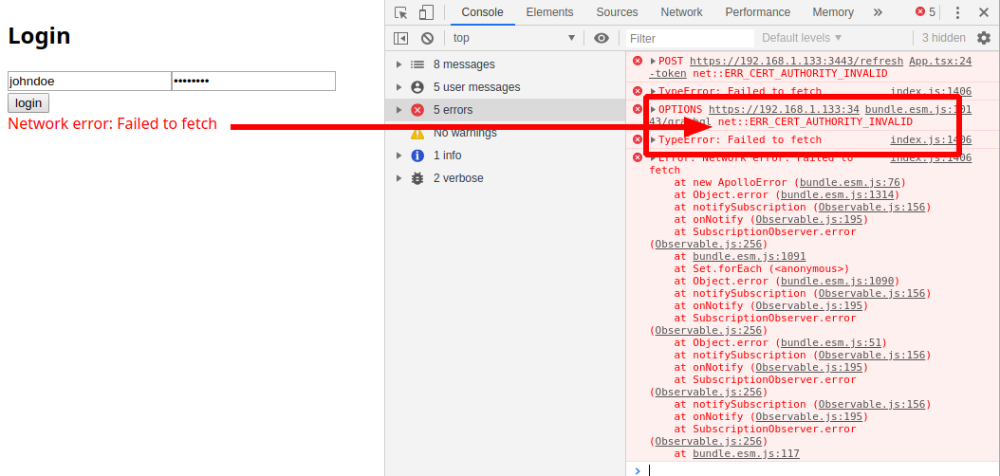

# README

- [README](#readme)
  - [Description](#description)
  - [Pre-Requisites](#pre-requisites)
  - [Configure environment variables](#configure-environment-variables)
  - [Configure IP and CORS](#configure-ip-and-cors)
  - [Start React Frontend](#start-react-frontend)
  - [Now play with Frontend](#now-play-with-frontend)
  - [Solving Problems with Certificates](#solving-problems-with-certificates)

## Description

A minimal React Hooks typescript frontend, with **JWT Auth** using **hyperledger network** and **person chaincode**, this front end is connected to  `server-graphql` project, use `apollo/react-hooks`, `react-router` and other cool stuff, ready to use has a base starter for hyperledger/convector/server-graphql

- login/logout
- auto refresh jwt token
- react routes
- graphql operations
  - query: persons, person profile
  - mutation: login and logout
  - subscriptions: transactions
- some context state

## Pre-Requisites

1. Node Js

2. this project must have a running **hurley hyperledger network** running, with **person chaincode** deployed follow instructions on [README.me](../../README.md)

> tip: use `restartEnv.sh` script to start / restart **hurley hyperledger network**

3. this project must have a running server-graphql [README.me](../server-graphql/README.md)

> tip: use `npx lerna run start:prod --scope @solidary-chain/server-graphql --stream`

## Configure environment variables

default `.env` config

```conf
# react env variables must be prefixed by REACT_APP_
REACT_APP_REST_SERVER_URI=https://localhost:3443
REACT_APP_GRAPHQL_SERVER_URI=https://localhost:3443/graphql

# Apollo
REACT_APP_APOLLO_FETCH_POLICY=network-only
REACT_APP_APOLLO_REJECT_UNAUTHORIZED=false

# require to prevent problems with create-react-app and "jest": "24.9.0"
SKIP_PREFLIGHT_CHECK=true
# NODE_TLS_REJECT_UNAUTHORIZED=0
```

## Configure IP and CORS

> if running frontend from other ip/fqdn than default `localhost:3000`, you must configure both frontend and graphql server `.env` to your own needs, both uri's must match, in below example we use a ip `192.168.1.133` has a example, but can be any valid fqnd like `example.com` etc

```shell
# edit frontend .env
$ nano packages/frontend-react/.env
```

and change `REACT_APP_REST_SERVER_URI` and `REACT_APP_GRAPHQL_SERVER_URI`, we enable https to...

```conf
# CRA: use HTTPS
HTTPS=true

# react env variables must be prefixed by REACT_APP_
REACT_APP_REST_SERVER_URI=https://192.168.1.133:3443
REACT_APP_GRAPHQL_SERVER_URI=https://192.168.1.133:3443/graphql

...

# require to prevent problems with create-react-app and "jest": "24.9.0"
SKIP_PREFLIGHT_CHECK=true
NODE_TLS_REJECT_UNAUTHORIZED=0
```

change graphql `.env` else we have cors and other problems, using same example of a machine with ip `192.168.1.133`

```shell
# edit backend .env
$ nano packages/server-graphql/.env
```

change `CORS_ORIGIN_REACT_FRONTEND`

```conf
...
# required to define when we don't use default origin http://localhost:3000
CORS_ORIGIN_REACT_FRONTEND=https://192.168.1.133:3000
```

## Start React Frontend

```shell
# generate graphql types/ every time we change .graphql files, or first time after cloned the project
$ npx lerna run gen:graphql --scope @solidary-chain/frontend-react

# run react frontend
$ npx lerna run start --scope @solidary-chain/frontend-react --stream
# output
@solidary-chain/frontend-react: Starting the development server...
@solidary-chain/frontend-react: Files successfully emitted, waiting for typecheck results...
@solidary-chain/frontend-react: Compiled successfully!
@solidary-chain/frontend-react: You can now view @solidary-chain/frontend-react in the browser.
@solidary-chain/frontend-react:   Local:            https://localhost:3000/
@solidary-chain/frontend-react:   On Your Network:  https://192.168.1.133:3000/
@solidary-chain/frontend-react: Note that the development build is not optimized.
@solidary-chain/frontend-react: To create a production build, use npm run build.
```

## Now play with Frontend

goto <https://localhost:3443> or <https://192.168.1.133:3443/graphql>

1. login with default user `johndoe`, password `12345678`, or other ledger person/user created with `rest server`, `graphql server` or `hurley`

2. wait for loading, remember we are interacting with blockchain, not a database, the operations are more slow...be patient

3. landing on homepage, with person listing

4. now you can play arround with the minimal setup, profile, context state, logout etc

done

## Solving Problems with Certificates



if have problems with self signed certifcates read [Fix apollo react ERR_CERT_AUTHORITY_INVALID](NOTES.md#fix-apollo-react-errcertauthorityinvalid) on [NOTES.md](NOTES.md)
